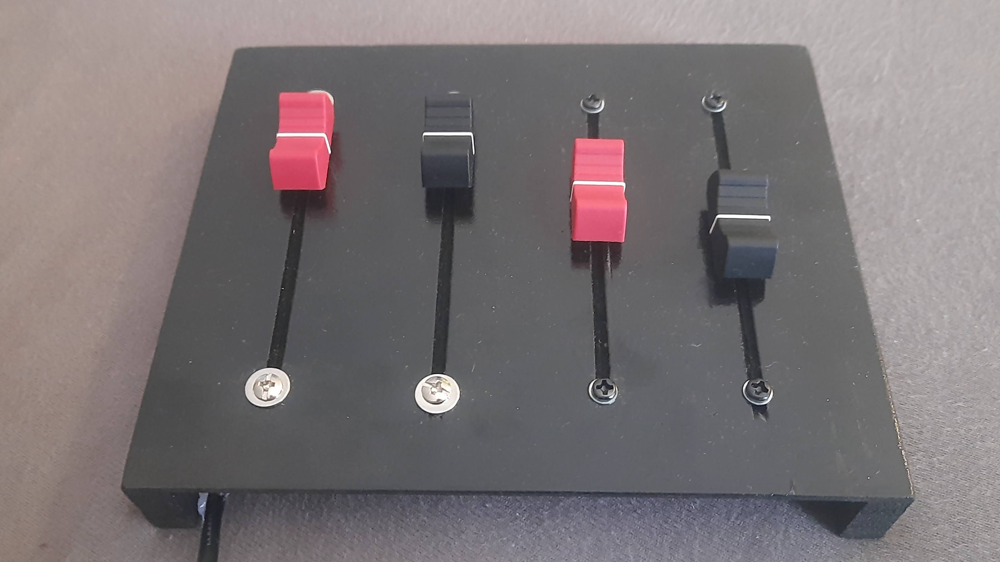
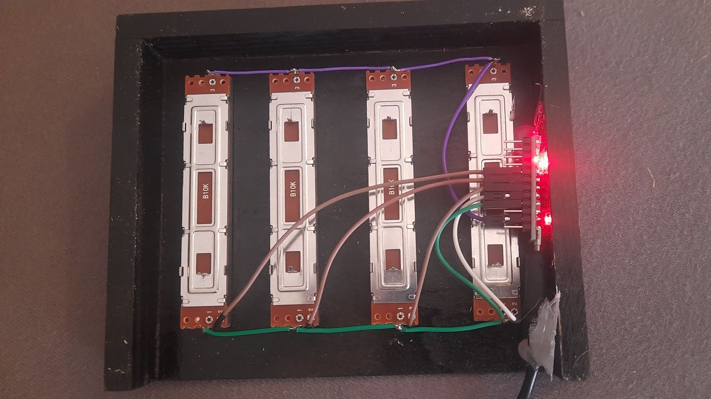

# Soundbox Mixer

## Features 
Soundbox Mixer is a project about controlling the volume of multiple apps on your PC by using a self made Soundmixer-Box with slider potentiometers. You can adjust the assignment of up to 4 sliders on your own. 

## Setup and Installation
### Hardware
You need:
- Arduino Pro Micro (not nano) or any other atmega32u4 board like Arduino Leonardo 
- 3-4 slider potentiometer like [here](https://www.amazon.de/-/en/gp/product/B07QVQ67MV/ref=ppx_yo_dt_b_asin_title_o05_s00?ie=UTF8&psc=1) and [here](https://www.amazon.de/gp/product/B07C91FFCZ/ref=ppx_yo_dt_b_asin_image_o04_s00?ie=UTF8&psc=1)
- some jumper wires

Screw the sliders into a box and connect them to the analog pins of the board like here:

Attach a USB-Cable to your board and plug it into your PC. Upload the "arduino_potentiometer.ino" sketch. Depending on your board and how you have connected your sliders, you maybe have to adjust this code on your own. 

Once it's done, your PC should identify your board as a game controller. Check it. 

### Software
1. Download latest installer and execute it
1. Plug in your device
1. Run the installed program, go to systemtray, right click symbol and open Configurator. Choose "Find device". Pick the device called like your board with its number
1. After testing, confirm to save the board
1. Restart the program
1. Should work :)

## Configuration
Run configurator.exe or sytemtray icon --> right click --> Configurator and choose one of the listed options.
